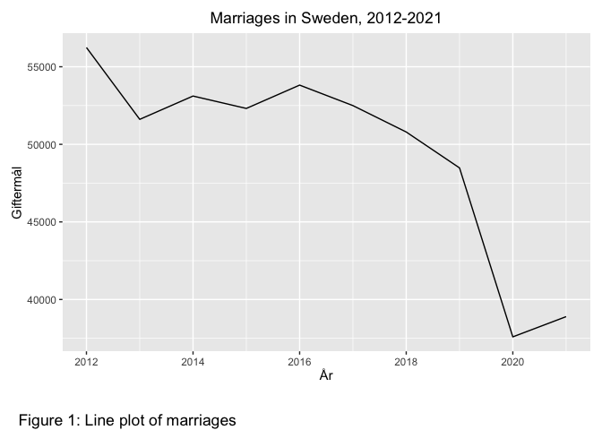

MT4007 - Homework 1
================
Sam Linderoth
2022-10-26

## Past experiences

My past experiences with R and associated packages and programs comes
mainly from earlier courses in mathematical statistics at Stockholms
universitet, like Statistical theory of inference and Stochastic
processes I.

My prior experience with Git/Github are nil, zero, zilch.

## A plot

<!-- -->

<https://www.statistikdatabasen.scb.se/pxweb/sv/ssd/START__BE__BE0101__BE0101L/GiftSkilsmassaTyp/>
